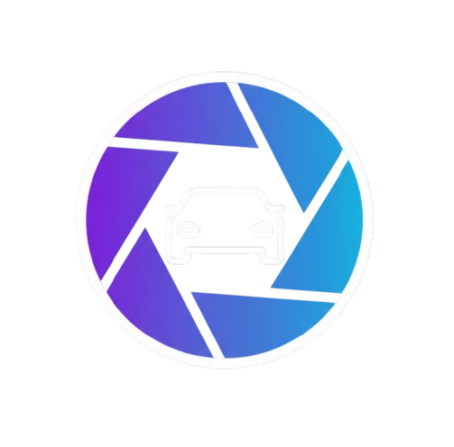

# CarLens 🚗 - Plataforma Automotiva Inteligente

Uma plataforma moderna e completa para busca, comparação e descoberta de carros, powered by IA do Google Gemini. Desenvolvida com Next.js 15 e React 19.

## 🚀 Demonstração Live

🌐 **[Acesse CarLens →](https://car-lens.vercel.app)**  
*Deploy otimizado no Vercel para máxima performance*



## 🤖 CarLens AI Consultant

**Consultora automotiva IA personalizada** que revoluciona sua experiência de compra! Utilizando Google Gemini:

- 🎯 **Recomendações Personalizadas**: Sugestões baseadas em suas necessidades e orçamento
- 💰 **Análise de Mercado**: Comparação de preços e oportunidades em tempo real
- 🔧 **Consultoria Técnica**: Dúvidas sobre mecânica, manutenção e especificações
- 📊 **Comparações Inteligentes**: Análise detalhada entre modelos diferentes
- 🛡️ **Dicas de Segurança**: Orientações sobre compra, documentação e seguros
- ⚡ **Disponibilidade 24/7**: Assistência instantânea com interface conversacional moderna
- 📱 **Mobile Responsive**: Chat otimizado para todos os dispositivos

## ✨ Funcionalidades Principais

- 🚗 **Busca Avançada**: Sistema de busca com filtros inteligentes (marca, modelo, localização, preço)
- 📋 **Catálogo Completo**: Navegação por todos os veículos disponíveis
- ⚖️ **Comparador**: Compare até 2 veículos lado a lado com análise detalhada
- 🤖 **IA Consultora**: Chat inteligente com botão flutuante e página dedicada
- 💻 **Interface Moderna**: Design futurista com gradientes, neon e glassmorphism
- 📱 **100% Responsivo**: Experiência perfeita em desktop, tablet e mobile
- ⚡ **Performance**: Otimizado com Next.js 15, React 19 e Vercel Edge Network

## 🚀 Deploy & Infraestrutura

### **Vercel - Plataforma Escolhida**
**CarLens** está hospedado no **Vercel** para máxima performance e confiabilidade:

✅ **Otimização Nativa Next.js 15**  
✅ **Edge Network Global** - Baixa latência mundial  
✅ **Auto-scaling Serverless** - Suporta picos de tráfego  
✅ **HTTPS Automático** - Segurança por padrão  
✅ **Deploy Contínuo** - Atualizações automáticas via Git  

### **Como Fazer Deploy**

#### 1. **Preparar Repositório**
```bash
# Clone o projeto
git clone https://github.com/seu-usuario/car-lens
cd car-lens

# Instale dependências
npm install

# Teste localmente (opcional)
npm run dev
```

#### 2. **Deploy no Vercel**
```bash
# Opção 1: Via CLI
npm i -g vercel
vercel --prod

# Opção 2: Via Dashboard Web
# 1. Acesse vercel.com
# 2. Import Git Repository
# 3. Selecione car-lens
# 4. Deploy automático!
```

#### 3. **Configurar IA (Opcional)**
Para ativar a IA Consultora, configure no Vercel Dashboard:
```env
# Settings → Environment Variables
GEMINI_API_KEY=sua_chave_google_gemini
```

🔗 **Obter chave**: [Google AI Studio](https://makersuite.google.com/app/apikey)

### **Performance Vercel**
- ⚡ **Build Time**: ~90s com Turbopack
- 🌍 **Global CDN**: <100ms latency worldwide  
- 📈 **Uptime**: 99.99% SLA garantido
- 🚀 **Cold Start**: <200ms serverless functions
- 📊 **Bandwidth**: 100GB/mês no plano gratuito

## 🛠️ Stack Tecnológico

### **Frontend & Framework**
- **Next.js 15.5.4** - App Router + Turbopack para builds ultra-rápidos
- **React 19.1.0** - Concurrent rendering e novas features
- **TypeScript** - Type safety e desenvolvimento robusto
- **Tailwind CSS v4** - Styling moderno e otimizado

### **IA & Backend**
- **Google Gemini AI** - Modelo @google/generative-ai v0.24.1
- **API Routes** - Endpoints serverless integrados
- **Server Actions** - Ações do lado servidor para performance

### **UX & Animações**
- **Framer Motion v12** - Animações fluidas e micro-interações
- **Lucide React** - Ícone SVG system otimizado
- **Responsive Design** - Mobile-first 320px até 4K
- **Glassmorphism UI** - Interface moderna automotiva

## 📁 Estrutura do Projeto

```
car-lens/
├── app/                    # 🏗️ Next.js 15 App Router
│   ├── ai/                # 🤖 IA Consultant página dedicada
│   ├── catalog/           # 📋 Catálogo completo veículos
│   ├── compare/           # ⚖️ Comparador side-by-side  
│   ├── api/ai/           # 🔌 Serverless IA Endpoint
│   ├── actions.ts         # Server Actions (busca/filtros)
│   └── layout.tsx         # Layout global + favicon CarLens
├── components/            # 🧩 Componentes reutilizáveis
│   ├── AIConsultant.tsx  # Chat modal responsivo IA
│   ├── AIFloatingButton.tsx # Botão flutuante com logo
│   ├── AdvancedFilters.tsx # Sistema filtros avançados
│   └── CarCard.tsx       # Cards veículos + status
├── lib/                  # 🔧 Services & Utils
│   ├── carService.ts     # Business logic veículos
│   └── utils.ts          # Helper functions
├── data/cars.json        # 🗄️ Database local (JSON)
└── public/               # 📁 Static assets
    ├── carlens_logo.png  # Logo oficial (favicon + UI)
    └── img_cars/         # Imagens veículos otimizadas
```

## 🎨 Recursos de Design

- **Branding CarLens**: Logo personalizada integrada ao favicon e interface
- **Paleta Neon**: Cores vibrantes (blue, purple, green) para tema automotivo
- **Glassmorphism**: Efeitos backdrop-blur e transparências
- **Gradientes Dinâmicos**: Fundos animados e transições fluidas
- **Mobile-First**: Interface otimizada para smartphones e tablets
- **Micro-interações**: Hover effects, loading states e animações contextuais
- **Sistema de Grid**: Layout responsivo com Tailwind CSS Grid
- **Typography**: Fontes Inter e Poppins para legibilidade perfeita

## 🤖 Como Usar a IA Consultora

### Métodos de Acesso
1. **Botão Flutuante**: Clique no ícone CarLens 🚗 no canto inferior direito
2. **Página Dedicada**: Visite `/ai` para experiência completa
3. **Interface Responsiva**: Chat otimizado para desktop e mobile

### Exemplos de Conversação
- *"Qual o melhor carro até R$ 100mil para família?"*
- *"Preciso de um SUV econômico e confiável"*
- *"Como negociar o preço de um carro usado?"*
- *"Diferenças entre Honda Civic e Toyota Corolla"*
- *"Carros automáticos mais econômicos de 2024"*
- *"Dicas de financiamento e documentação"*

### Recursos Especiais
- 💬 **Chat Conversacional**: Interface moderna com typing indicators
- 🎯 **Perguntas Rápidas**: Sugestões contextuais para começar
- 📱 **Mobile Otimizado**: Modal full-screen em dispositivos móveis
- ⚡ **Respostas Rápidas**: Powered by Google Gemini para precisão

## 📊 Performance & Métricas

- ⚡ **Next.js 15 + Turbopack**: Build e reload ultra-rápidos
- 🚀 **React 19**: Renderização otimizada e concurrent features
- 📱 **Mobile-First**: Interface responsiva desde 320px até 4K
- 🔄 **Real-time Search**: Busca instantânea sem reload
- 💾 **Dados Locais**: Base JSON para consultas rápidas offline
- 🎨 **CSS Otimizado**: Tailwind CSS v4 com purging automático
- 🤖 **IA Responsiva**: Chat com loading states e error handling

## 🔐 Privacidade e Segurança

- 🛡️ Não armazenamos conversas pessoais
- 🔒 Chaves API seguras com variáveis de ambiente
- 📊 Dados públicos de veículos apenas
- 🌐 Comunicação criptografada (HTTPS)

## 📈 Roadmap & Próximas Features

### Em Desenvolvimento 🚧
- [ ] Integração com APIs de concessionárias reais
- [ ] Sistema de favoritos e wishlist
- [ ] Calculadora de financiamento integrada
- [ ] Histórico de conversas com IA

### Futuro 🔮
- [ ] Sistema de agendamento de test drives
- [ ] Notificações push para ofertas
- [ ] Chat com vendedores reais
- [ ] App mobile nativo (React Native)
- [ ] Sistema de reviews e avaliações

### Melhorias Contínuas 🔄
- [ ] Otimização de performance
- [ ] Mais modelos de carros
- [ ] IA ainda mais inteligente
- [ ] Acessibilidade aprimorada

---

<div align="center">

**CarLens** 🚗✨  
*Revolucionando a descoberta de carros com IA e tecnologia de ponta*

Desenvolvido com ❤️ usando **Next.js 15** + **React 19** + **Google Gemini**

</div>